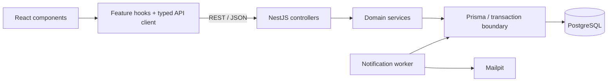

# Pandora — Coding Standards

> **Revision:** 2026-09-29  
> **Applies to:** Target React/Vite + NestJS + PostgreSQL/Prisma architecture  
> **Product context:** [project-overview.md](./project-overview.md)

These standards define how to implement and verify Pandora. The project overview defines product behavior, scope, and business invariants; feature specifications define detailed acceptance criteria. Keep those responsibilities separate and resolve conflicts explicitly rather than silently changing requirements.

## 1. Architecture and adoption

- Target frontend: React, TypeScript, Vite, React Router, TanStack Query, CSS Modules.
- Target backend: NestJS modular monolith, REST API, OpenAPI, Prisma, PostgreSQL.
- Background worker: durable notification processing against the PostgreSQL outbox and captured SMTP delivery.
- The existing Next.js/Tailwind starter is not yet this target architecture. For work on that starter, inspect its actual configuration and scripts; do not introduce target-only paths or tools piecemeal.
- Reconcile the starter with the target as an explicit implementation task. Update repository instructions, scripts, and structure together. These standards do not authorize unrelated framework migrations.
- Do not introduce Next.js Server Actions, React Server Components, Tailwind, or an additional component library into the target application without an architecture decision.
- Pin runtime/package-manager versions and commit the selected package manager's lockfile. Use one package manager consistently. Write commands for installed versions rather than assuming that current online documentation matches the project.



The frontend never connects to Prisma or the database. Controllers and workers call domain/application services rather than reproducing business rules. Infrastructure adapters handle external effects.

## 2. TypeScript

- Enable `strict` in every application and shared package. Do not weaken compiler settings to bypass implementation errors.
- Do not introduce explicit `any`. Treat untrusted input and caught errors as `unknown`, then validate or narrow them.
- Use `type` or `interface` according to the shape being modeled. Prefer discriminated unions for mutually exclusive states and results.
- Infer obvious local types; explicitly type component props, public function boundaries, and published contracts where it improves clarity.
- Derive types from validation schemas or generated contracts where practical. Do not maintain independent handwritten copies of the same contract.
- Separate persistence models, request/response DTOs, and UI view models. Map deliberately between them; never return a full database record merely because it is convenient.
- Avoid non-null assertions and type assertions that hide uncertainty. Do not use `as` to pretend an unvalidated HTTP response is valid.
- Use `import type` for type-only imports. Keep shared frontend contracts free of backend implementation and secrets.
- Prefer explicit return types for exported domain operations and shared utilities. Exhaustively handle finite business states.

## 3. Structure and naming

Organize by business feature. Keep feature-specific components, hooks, schemas, and tests close to the feature; move code into shared folders only when reuse is real.

The following is the target layout, to establish during architecture setup rather than assume already exists:

```text
apps/
  web/src/
    app/                      # Providers and application setup
    routes/                   # Route composition
    features/
      orders/                 # Components, hooks, API mappings, local types
      catalog/
      inventory/
    components/               # Shared UI primitives
    lib/                      # API client and cross-feature utilities
    styles/                   # Global foundations and design tokens
  api/src/
    modules/
      orders/                 # Controller, service, DTO/schema, tests
      catalog/
      inventory/
    common/                   # Shared guards, errors, correlation, clock
    infrastructure/           # Prisma, SMTP, logging adapters
  notification-worker/        # Worker entry point; no duplicated domain rules
packages/
  contracts/                  # Public API contracts and reusable schemas
prisma/                       # Persistence definition and migration assets
```

- React components and their files: `PascalCase`, such as `OrderSummary.tsx`.
- CSS Modules: match the component, such as `OrderSummary.module.css`.
- Hooks: `use` prefix, such as `useOrderDetails.ts`.
- Backend files: descriptive kebab-case with NestJS suffixes, such as `orders.service.ts`.
- Functions and variables: `camelCase`; types/classes/interfaces: `PascalCase`, without `I` prefixes.
- Module-level immutable configuration constants: `SCREAMING_SNAKE_CASE`; ordinary local `const` bindings remain camelCase.
- Keep dependencies directed between explicit module interfaces. Avoid circular imports, cross-feature internal imports, and generic `utils` collections with unrelated responsibilities.

## 4. React and server state

- Use functional components and hooks. Keep render logic pure and components focused on a coherent responsibility.
- Keep business rules and persistence operations out of components. UI eligibility hints do not replace backend validation.
- Use TanStack Query for server data, loading/error states, cache invalidation, and mutations. Use React state for local interaction state.
- Use stable query keys that include relevant resource, filter, pagination, and organization context. Clear protected cached data when the authenticated session changes or ends.
- Call the API through a shared typed client. Centralize credentials, CSRF handling, error parsing, and correlation metadata there.
- Do not automatically retry consequential mutations without their defined idempotency behavior. A retry of the same operation reuses its key; a new operation uses a new key.
- Await authoritative results for stock, confirmation, shipment, and return operations. Do not present speculative stock changes as committed outcomes.
- Invalidate or update all affected queries after a successful mutation. Handle submission/version conflicts without discarding unsaved form input.
- Prefer derived values over duplicated state. Use effects to synchronize with external systems, not to maintain values calculable during rendering.
- Extract custom hooks for reusable behavior or substantial feature orchestration. Avoid abstractions that only rename a single simple call.
- Use stable identifiers for React keys and repeated business rows, never indexes when items can move, appear, or disappear.

## 5. Styling and accessibility

- Use CSS Modules for component styling and a small global stylesheet for resets, typography, and design tokens.
- Use CSS custom properties for semantic colors, spacing, radii, typography, and layering. Avoid scattering equivalent magic values across components.
- Follow the overview's warm light palette, terracotta accent, and typography. Dark mode is an additional product decision, not a default requirement.
- Keep static styles in stylesheets. Typed inline styles or CSS variables are acceptable for genuinely dynamic values.
- Use semantic HTML and native controls where appropriate. Interactive elements need accessible names, keyboard behavior, visible focus, and appropriate disabled/loading feedback.
- Associate form errors with their fields. Do not communicate status only through color or a transient toast.
- Make dialogs accessible, including focus management and returning focus to the trigger. Respect reduced-motion preferences.
- Verify catalog and order review on narrow screens. Keep operational tables usable through deliberate overflow or responsive presentation.
- Follow the selector contract in the overview. Preserve stable `data-test` values and scope repeated targets with business identifiers. Do not add or remove coverage opportunistically.

## 6. Backend and API contracts

- Keep controllers thin: parse HTTP input, invoke authorization/validation and an application operation, then return the documented response.
- Keep business transitions, stock eligibility, and transaction orchestration in explicit services. Keep pure calculations independently testable.
- Use dependency injection for persistence, clocks, SMTP, and other external boundaries. Never instantiate a production adapter inside a domain calculation.
- Define request and response DTOs separately. Explicitly select response fields to prevent accidental disclosure of credentials, internal flags, or another organization's data.
- Use OpenAPI as the published HTTP contract. Keep runtime validation, response mapping, documented statuses, and generated client types aligned.
- Use Zod for request schemas, integrated through a consistent NestJS validation pipe/adapter. Validate body, path, and query input at the API boundary; frontend validation is supplementary.
- Integrate shared schemas with OpenAPI during API setup. Do not maintain two independent rule sets for the same request. TypeScript types alone do not validate runtime values.
- Reject unexpected mutation fields instead of passing raw request objects into Prisma. Make allowed filters and sort fields explicit.
- Enforce role and organization access on every relevant operation. Never trust a client-supplied retailer ID as authorization, and never replay an idempotency response before checking current access.
- Use the overview's HTTP semantics and stable machine-readable error codes. Preserve a consistent error envelope with `code`, `message`, `correlation_id`, and documented field/detail types.
- Do not wrap failures in HTTP `200` responses with `success: false`. Success responses and error responses must match the endpoint contract.
- Catch errors where they can be meaningfully translated, recovered from, or enriched. Use a central exception filter for consistent HTTP mapping; do not add catch-and-rethrow blocks everywhere.
- Keep list queries bounded and deterministic. Apply filters before pagination and include a unique tie-breaker in sorting.

## 7. Persistence, transactions, and migrations

- Use Prisma as the default database access layer behind backend services. Reuse the configured client; do not create a new client per request.
- Allow reviewed, parameterized SQL when a database capability or migration requires it. Never interpolate untrusted values into SQL or use unsafe query construction.
- Store money as integer minor units, enforce quantity bounds, and check arithmetic against supported storage ranges. Do not calculate business totals with floating-point currency values.
- Store timestamps consistently in UTC. Inject the application clock where time affects behavior; keep database defaults and test clock behavior explicitly coordinated.
- Apply product invariants through validation, transaction logic, and database constraints. Application checks alone do not protect concurrent writes.
- Make the business mutation, stock changes, inventory movements, audit records, applicable outbox jobs, and successful idempotency receipt atomic.
- Pass the active transaction client through participating persistence operations. Do not accidentally use the global client halfway through a transaction.
- Use the isolation and bounded retry policy specified in the overview. Retry the complete transaction only for classified retryable failures, not validation, authorization, or arbitrary exceptions.
- Keep transactions short. Do not send SMTP, call remote services, or perform other nontransactional external effects inside a transaction or its retry callback.
- Maintain a migration history in version control. Review generated changes, data transformations, constraints, and destructive operations before applying them.
- Do not rewrite migrations already applied to shared environments. Add a corrective migration instead.
- Use migration scripts appropriate to the pinned Prisma major version. Do not prescribe CLI commands that have not been verified against that version.
- Development/reset commands target disposable development databases only. Shared environments receive reviewed migrations through a controlled deployment step; failure blocks rollout.
- Treat migration status as one diagnostic, not proof that every schema constraint and behavior is correct. Verify affected migrations and database behavior on an isolated environment.
- Never silently replace migrations with schema-push commands to make an error disappear.

## 8. Security and operational behavior

- Apply the overview's server-side session, expiry, revocation, cookie, CSRF, and retailer-isolation rules. Do not store session credentials in browser local storage.
- Parse and validate runtime configuration at startup. Fail clearly when required configuration is missing; never fall back to a shared/demo database implicitly.
- Keep secrets out of source control, frontend bundles, logs, errors, and audit payloads. Commit only safe example configuration.
- Propagate correlation IDs through HTTP responses, structured logs, audit records, and asynchronous jobs. Sanitize externally supplied identifiers before logging or propagation.
- Distinguish operational logs, business audit events, and inventory movements. Do not use logs as the only record of a business change.
- Process notification jobs with explicit ownership/lease and bounded retry behavior. A failed delivery must not repeat the originating business operation.
- Do not claim exactly-once email delivery merely because outbox records are deduplicated. Model and expose ambiguous attempts and retries.
- Keep Bug Lab and failure injection behind validated, isolated environment configuration. Public demo startup must reject Bug Lab configuration.
- Keep Standard-mode behavior authoritative. Defect selection must be explicit and reproducible; avoid scattered environment checks throughout unrelated code.

## 9. Verification and code quality

- Run the repository's configured type checks, lint, relevant tests, and applicable build checks. Report what was actually run and any remaining gaps; do not invent script names or successful results.
- Use focused unit tests for meaningful pure logic and state derivation. Use real PostgreSQL integration checks for transaction, constraint, isolation, and concurrency behavior; mocks alone cannot verify those properties.
- For consequential mutations, verify persisted state as well as the response: authorization, invalid input, idempotency, version conflicts, rollback, audit, stock movements, and applicable outbox effects.
- Coordinate concurrency scenarios deterministically. Avoid arbitrary sleeps and timing luck as test synchronization.
- Keep fixtures and seed data reproducible. Isolate shared inventory, notification jobs, worker ownership, and clocks across independent runs.
- Place companion portfolio E2E/API automation and release evidence in the QA repository. Keep application-level verification close to the behavior it protects and define CI ownership during setup.
- Test observable behavior, contracts, and invariants. Avoid tests that merely mirror implementation or assert private helper call sequences without a behavioral reason.
- Add regression coverage for material defects where practical. Scale verification to risk; documentation or harmless presentation edits do not require unrelated test suites.
- Keep functions cohesive and readable. A roughly 50-line function is a review prompt, not a rule requiring artificial fragmentation of a transaction or workflow.
- Remove unused imports, variables, and abandoned commented-out code. Retain comments that explain non-obvious decisions, invariants, and tradeoffs.
- Avoid speculative frameworks and premature generic abstractions. Follow established formatting and lint rules; do not mix unrelated cleanup with a feature change.

## 10. Completion and documentation

- Keep OpenAPI, generated contracts, migrations, selector coverage, and feature acceptance criteria synchronized with intentional behavior changes.
- Update the overview when product scope or invariants change, not for every implementation detail. Record consequential architecture choices separately.
- Preserve the user's existing work and review the final diff. Do not make unrelated changes to framework, dependencies, or repository organization.
- A consequential feature is complete when its relevant acceptance criteria are verified, failures have defined behavior, and committed effects remain consistent. A working happy-path screen alone is insufficient.
- In handoff notes, state what changed, how it was verified, and any unresolved limitations. Never describe a planned behavior as already implemented.
