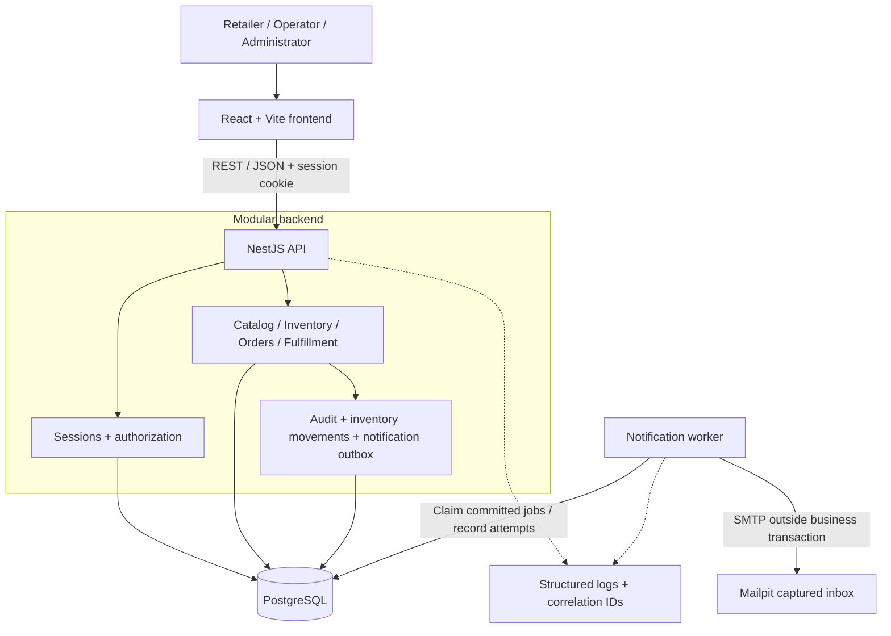
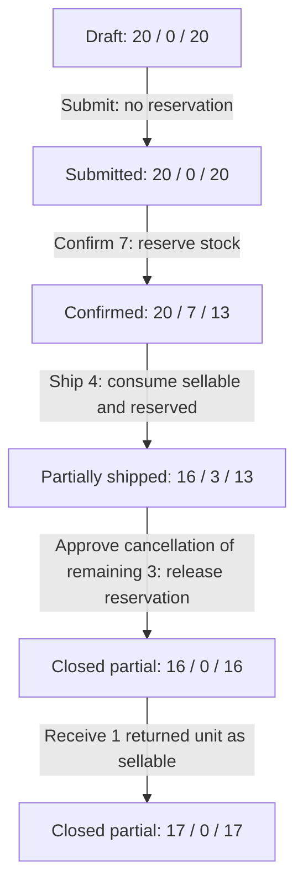

# Pandora — Project Overview

> **Revision:** 2026-09-30
> **Status:** Phase 1 core ordering and fulfillment implemented; organization/user administration merged; isolated local demo reset implemented and verified on its feature branch; public deployment/scheduling remain planned
> **Purpose:** Persistent product context for contributors and coding agents

Pandora is a B2B order and inventory management sandbox for a fictional board-game distributor serving retail stores. It showcases Aleksandar Parabucki's Senior QA skills through a working application, explicit business rules, automated testing, reproducible defects, and evidence-based quality ownership.

The application must provide a correct **Standard mode**. An isolated **Bug Lab** introduces controlled defects for QA exercises. Pandora is a portfolio project, not a real commerce service: **no AI features, real payments, real customer data, or mandatory paid integrations**. Game names, publishers, descriptions, and artwork must be original and fictional.

## 1. How to use this document

This overview defines the product baseline, target boundaries, and cross-cutting invariants. It consolidates the existing planning documents; it does not claim that the described features are implemented or that every planning detail has received separate user approval. Explicit user decisions take precedence over this baseline.

- Use this document as the single overview referenced by `AGENTS.md`; do not load competing overview versions as additional authorities.
- Read implementation details and acceptance criteria for the current feature when available. Do not assume that referenced or planned documents already exist.
- Keep detailed schemas, endpoint catalogs, deployment runbooks, and Bug Lab solutions outside this always-loaded overview.
- Treat the implemented database schema and OpenAPI definition as evidence of current behavior, not permission to silently replace intended business rules. Resolve discrepancies explicitly.
- Changes to business behavior, scope, or target architecture must be recorded as decisions rather than inferred from a code example.

## 2. Current implementation versus target architecture

**Observed repository baseline on 2026-09-30:** the original Next.js starter has been replaced by the target stack as a pnpm workspace skeleton: `apps/web` (React/Vite), `apps/api` (NestJS), `packages/contracts`, `prisma/`, and Docker Compose with PostgreSQL. It contains health checks and authentication (organizations, users, server-side sessions, role and CSRF guards, seeded demo accounts); catalog browsing and administrator management with language/edition variants, EUR prices, and essential transactional audit are implemented. Inventory is implemented: stock per SKU, receipts and adjustments with movements and audit, `Idempotency-Key` handling, and Serializable transactions with bounded retry. `reserved` tracks outstanding stock reservations created at order confirmation. Order drafts, submission with price review and frozen snapshots, and retailer cancellation are implemented. Staff confirmation with all-or-nothing stock reservation and rejection with a reason are implemented. Fulfillment is implemented: shipments consume reservations, retailers request cancellation of all remaining quantities and staff approve or reject, and the status is derived from the quantities. Minimal organization and user administration is implemented: retailer organizations, accounts, staff roles, deactivation, and password resets with immediate session revocation, plus protection of the distributor and the last administrator. Sign-in is rate-limited per email (5 attempts per 15 minutes, identical for unknown accounts), and sessions that have been unusable for more than 24 hours are cleaned up automatically. An isolated local Docker demo has operator reset tooling with maintenance, stopped writers, atomic seed restoration, and fail-closed recovery; see [the runbook](features/demo-reset-verification.md). Public deployment/scheduling, line-level cancellation requests (Phase 2), and returns remain planned. `AGENTS.md` describes the current commands and layout.

**Target design inherited from the planning documents:** React/Vite frontend, NestJS backend, PostgreSQL, and Prisma. The skeleton follows this design; the parts listed below that are not yet built remain planned, not implemented.

| Layer | Target |
|---|---|
| Frontend | React, TypeScript, Vite, React Router, TanStack Query, CSS Modules |
| Backend | Node.js, TypeScript, NestJS modular monolith; REST with OpenAPI |
| Persistence | PostgreSQL, Prisma ORM, Prisma Migrate |
| Authentication | Server-side PostgreSQL sessions; cookie authentication, CSRF, RBAC |
| Notifications | PostgreSQL transactional outbox, background worker, Mailpit SMTP capture |
| Environment | Docker Compose, environment configuration, isolated dev/QA/demo resources |

Use thin controllers and explicit domain services. PostgreSQL is the source of truth for business state. The worker handles asynchronous notification delivery; microservices are outside the target design.

### Target system architecture



The backend modules share one database. Business mutations, their audit records, and applicable stock movements commit together. The diagram also includes the planned notification outbox and worker: outbox jobs will commit with the originating mutation and delivery will happen afterward. Sessions, catalog, inventory, ordering, fulfillment, and organization/user administration are implemented; the outbox, worker, and Mailpit remain planned.

Keep `AGENTS.md`, commands, and implementation documentation in sync as the architecture grows. Use actual repository scripts for existing code.

## 3. Product boundaries and users

The target MVP includes **one distributor, multiple retailer organizations, one warehouse, and one configured currency**. It covers catalog, inventory, orders, reservations, shipments, cancellations, returns, audit, captured notifications, and deterministic sandbox tooling.

Out of scope: invoices, taxes, discounts, shipping fees, monetary refunds, carriers, delivery tracking, proof of delivery, multiple warehouses/distributors, currency conversion, backorders, partial order confirmation, automatic order expiration, public registration, email invitations, self-service password recovery, and general-purpose business-rule configuration.

| Capability | Retailer | Distributor operator | Administrator |
|---|---|---|---|
| Browse active catalog and availability | Yes | Yes | Yes |
| Create, edit, submit drafts; request cancellation/return | Own organization | No | No |
| View orders, shipments, business history | Own organization | All retailers | All retailers |
| Confirm/reject orders; ship; decide cancellations/returns; receive returns | No | Yes | Yes |
| Record stock receipts and adjustments | No | Yes | Yes |
| Manage catalog, organizations, users | No | No | Yes |
| Inspect system-wide audit and notification diagnostics | No | Operational scope | Full scope |
| Enable Bug Lab or reset environments through business UI/API | No | No | No |

Retailers belong to retailer organizations; staff belong to the distributor organization. Users within a retailer organization share drafts and orders. There is no separate QA application role: reviewers use predefined accounts, and sandbox tooling remains outside business permissions.

Enforce permissions in the backend even when the UI hides an action. Cross-retailer resource access returns `404`; a forbidden role action returns `403`. Deactivation preserves history and does not release stock automatically. The distributor organization and final active administrator cannot be deactivated; the final administrator cannot be demoted.

## 4. Catalog, drafts, and submission

- A `Product` is a base game or expansion. An expansion references a base game, never itself or another expansion. Purchasing the base game is not required.
- A `ProductVariant` is a sellable language/edition combination with a unique, stable SKU. Prices use nonnegative integer minor units; ordered quantities are positive integers.
- Availability and price always refer to the selected variant. Historical records survive product or account deactivation.
- Drafts are editable and shared within the retailer organization. Every draft mutation supplies the current order version; successful mutation advances it. A stale version returns `409 VERSION_CONFLICT` without overwriting another user's changes.
- Draft prices are provisional. Submission validates the reviewed price; price drift returns `409 PRICE_CHANGED` for review before resubmission.
- Submission freezes SKU, product name, language, edition, unit price, line totals, and order total. Later catalog edits never change that history.
- Draft and submitted orders reserve **no stock**. Availability shown before confirmation is not a stock guarantee.

The eventual persistence model must distinguish provisional draft values from frozen submitted snapshots. Do not make required snapshot fields accidentally prevent draft creation or imply that prices freeze when a draft is first saved.

## 5. Order lifecycle and inventory invariants

The basic workflow is: retailer drafts → submits → staff confirms and reserves all lines → staff ships → any remaining quantity is shipped or cancelled. Staff may reject a submitted order with a reason. Retailers may cancel the entire draft or submitted order.

### Order state transitions

```mermaid
stateDiagram-v2
    direction TB
    [*] --> draft
    draft --> submitted: Submit and freeze snapshots
    draft --> cancelled: Retailer cancels whole order
    submitted --> cancelled: Retailer cancels whole order
    submitted --> rejected: Staff rejects with reason
    submitted --> confirmed: Confirm and reserve all lines atomically

    confirmed --> confirmed: Approve cancellation of some units; remainder outstanding
    confirmed --> partially_shipped: Ship some units; remainder outstanding
    confirmed --> shipped: Ship all ordered units; none cancelled
    confirmed --> cancelled: Approve cancellation of all units; none shipped
    confirmed --> closed_partial: Ship all remaining units after earlier cancellation

    partially_shipped --> partially_shipped: Ship or approve cancellation; remainder outstanding
    partially_shipped --> shipped: Ship remainder; none cancelled
    partially_shipped --> closed_partial: Ship or approve cancellation; nothing outstanding and some cancelled

    rejected --> [*]
    cancelled --> [*]
    shipped --> [*]
    closed_partial --> [*]
```



Only successful actions are shown. A rejected operation leaves state and stock unchanged; a pending cancellation request does not change fulfillment status. Returns are a separate workflow and do not add transitions out of these terminal states. The quantity table below defines the conditions behind the shipment/cancellation arrows.

| Current state | Action | Result |
|---|---|---|
| `draft` | Submit | `submitted`, snapshots frozen, no reservation |
| `draft` / `submitted` | Retailer cancels whole order | `cancelled`, no stock effect |
| `submitted` | Staff rejects | `rejected`, no stock effect |
| `submitted` | Staff confirms | `confirmed`, all lines reserved atomically |
| `confirmed` / `partially_shipped` | Ship or approve cancellation | Derive status from cumulative quantities below |

For each confirmed order line:

```text
outstanding = ordered − shipped − approved_cancelled
available = physical_sellable − reserved
reservation_remaining = quantity_reserved − quantity_consumed − quantity_released
```

Derive the order status using totals across its lines:

| Outstanding | Shipped | Approved cancelled | Status |
|---|---|---|---|
| > 0 | 0 | Any | `confirmed` |
| > 0 | > 0 | Any | `partially_shipped` |
| 0 | All ordered units | 0 | `shipped` |
| 0 | 0 | All ordered units | `cancelled` |
| 0 | > 0 | > 0 | `closed_partial` |

These derivation rules apply after confirmation, not to drafts or submitted orders. They also cover a final shipment after an earlier cancellation: that order ends `closed_partial`, not `shipped`.

`rejected`, `cancelled`, `shipped`, and `closed_partial` are terminal for order fulfillment. Returns have a separate lifecycle and never reopen or change fulfillment status. Unsupported transitions return `409 INVALID_ORDER_TRANSITION`.

Standard-mode invariants:

- Sellable, reserved, damaged, and remaining reservation quantities cannot be negative; reserved cannot exceed sellable stock.
- Reserved inventory is the transactional aggregate of remaining reservations and cannot be edited directly. Damaged inventory is tracked separately and cannot be reserved or sold.
- Confirmation is all-or-nothing across every line. Insufficient stock returns `409 INSUFFICIENT_STOCK`, leaves the order submitted, and reserves nothing.
- Shipments cannot exceed outstanding quantities or remaining reservations. They consume sellable and reserved stock equally and are immutable, uniquely referenced dispatch records.
- Approved cancellation releases the corresponding reservation. Shipped plus approved-cancelled quantities never exceed ordered quantities.
- Stock receipts and manual adjustments produce inventory movements; adjustments require a reason and must preserve stock invariants.
- Retries must not duplicate business effects, reservations, or inventory movements.

### Worked inventory flow

Each box shows **sellable / reserved / available** quantities for one SKU. This example starts with 20 sellable units and an order for 7.



Shipping reserved units leaves availability unchanged. Cancelling releases availability without adding physical stock. A sellable return increases physical stock and availability; a damaged return would increase only damaged stock. Neither type of return changes the order's fulfillment status.

## 6. Cancellations and returns

**Cancellation:** before confirmation, only whole-order cancellation is supported and is auto-approved, attributed to the retailer actor. After confirmation, the retailer requests selected unshipped quantities; staff approve the whole request or reject it with a reason. There is no partial approval. A pending request does not release stock. Revalidate quantities when approving; an intervening shipment that makes the request ineligible returns `409 CANCELLATION_CONFLICT`.

**Return:** each item references a shipment item from the requesting retailer's own order. Staff approve or reject the whole request. Each approved return has one final receipt/inspection, split into sellable and damaged units. Sellable units increase sellable inventory; damaged units increase only damaged inventory. A short receipt requires a discrepancy reason.

For each shipment item, quantities in pending or approved returns plus quantities actually received in completed returns cannot exceed shipped quantity. Rejected requests do not consume entitlement; completed returns count actual received units instead of their original requested quantity. A receipt cannot exceed the approved quantity. Enforce entitlement checks transactionally to prevent concurrent double claims; violations return `409 RETURN_QUANTITY_EXCEEDED`.

## 7. Consistency, API behavior, and sessions

Require `Idempotency-Key` for draft creation, submission, confirmation/rejection, shipment creation, cancellation request/decision, return request/decision/receipt, stock receipt/adjustment, and manual notification retry. Scope the key by organization, actor, operation, and target resource where one exists.

- Same key and payload: replay the original committed response.
- Same key with a different payload: `409 IDEMPOTENCY_KEY_REUSED`.
- Same key while processing is in progress: `409 REQUEST_IN_PROGRESS`.
- Missing required key: `400 IDEMPOTENCY_KEY_REQUIRED`.
- Rollback must not leave a successful idempotency receipt or committed business effects.

Persist a canonical payload hash and committed response. Draft editing additionally uses version checks. Idempotency requirements for authentication, catalog/user administration, and other mutations must be specified with those endpoint contracts; the list above is not a blanket requirement for every HTTP mutation.

Use short PostgreSQL Serializable transactions for stock workflows. In one transaction: reread current state → validate authorization/state/quantities → update business state and stock → record inventory movement and audit → enqueue notification when applicable → record successful idempotency response → commit. Retry the **whole transaction** on serialization/write conflicts, up to three total attempts; exhaustion returns `409 CONCURRENT_MODIFICATION`.

Use database constraints alongside application validation and transactional checks. Never send SMTP inside a database transaction. Notification jobs are durable and deduplicated by business event and recipient; delivery attempts and retries must not repeat business effects. Do not equate outbox deduplication with a guarantee of exactly-once SMTP delivery.

REST errors expose stable `code`, readable `message`, `correlation_id`, and consistently typed field/detail information. Use `400` for malformed requests, `401` for invalid sessions, `403` for forbidden roles, `404` for absent/hidden resources, `422` for invalid field values, and `409` for business/state/version conflicts. Define the exact response schema in OpenAPI before implementation.

List APIs use server-side filtering and pagination: default page size 20; supported sizes 20, 50, 100. Apply filters before pagination and include a unique ID tie-breaker in every sort.

Sessions use random browser tokens with only their hashes stored server-side. Cookies are HttpOnly, Secure on HTTPS, and SameSite=Lax; cookie-authenticated mutations require CSRF protection. Sessions expire after 30 minutes of inactivity or 8 hours absolute, whichever comes first. Logout, deactivation, role changes, organization deactivation, and administrative password resets revoke affected sessions immediately. Never expose credentials, session tokens, cookies, secrets, or internal stack traces in API errors or audit payloads.

## 8. UI and automation contracts

Visual direction: warm off-white, high-contrast dark text, muted terracotta primary actions, restrained semantic colors, original fictional artwork, serif headings, and readable sans-serif operational text. Use product cards for the catalog and structured tables for staff workflows.

Retailers land on the catalog; operators on orders awaiting processing; administrators on catalog/organization/user management. Require variant selection before adding quantities. Distinguish saving a draft from submitting it and explain that submission does not reserve stock. Preserve unsaved input on version conflicts and offer reload/reconciliation. Show ordered, reserved, shipped, cancelled, and remaining quantities; show returns separately.

Support semantic HTML, keyboard navigation, visible focus, accessible dialogs, meaningful alt text, WCAG AA contrast, text alongside status colors, and reduced motion. Optimize operational screens for desktop while keeping catalog and order review usable on mobile/tablet.

Approximately 80% of distinct automation-relevant targets expose stable `data-test="kebab-case-purpose"` attributes. The remaining approximately 20% intentionally exercise semantic/accessibility locators or stable CSS relationships/relative XPath. Never rely on generated CSS-module classes, absolute XPath, row position, or timestamps. Scope repeated targets with a stable SKU or order number. Maintain an explicit list of intentionally uncovered targets; renaming/removing a `data-test` is a contract change.

The companion QA repository owns portfolio automation, exploratory records, and release evidence. This separation does not waive application verification or prohibit focused unit/integration tests. Decided (2026-09-30):
- Application checks and CI live in this repository: `pnpm check:all` and GitHub Actions on pushes to `main` and on pull requests.
- The QA repository keeps portfolio E2E automation and release evidence.

## 9. Sandbox, Bug Lab, and observability

Seed data is deterministic and version-controlled: all roles, at least two retailers, base games and expansions, language/edition variants, normal/low/zero stock, inactive records, and representative lifecycle states. Isolate test runs across products, inventory, orders, jobs, and worker ownership. Different retailer organizations alone do not isolate tests because they share stock.

Store time in UTC and display it with Europe/Belgrade context. Use a replaceable backend clock and configurable test retry timing; changing browser time does not change backend time. Controlled delivery failures use replaceable adapters in isolated environments.

The public demo runs Standard mode with its own database, worker, and captured inbox. The target reset schedule is daily at 03:00 Europe/Belgrade, executed by deployment automation/operator tooling: enter maintenance → reject mutations → pause workers and drain active work → revoke sessions → restore seed and associated job/idempotency state → resume only after successful restoration. Failure leaves maintenance active. Hosting and scheduler remain open decisions.

Bug Lab runs only in an explicitly isolated local/QA environment with separate database, worker, and inbox. The public demo rejects Bug Lab configuration. Initially exactly one known defect may be selected; reject unknown or multiple IDs. Switching defects requires restart and reset/reseed. Authentication, RBAC, retailer isolation, and secret handling remain correct for every defect.

| Initial defect | Incorrect behavior | Reproduction prerequisite |
|---|---|---|
| `BUG-001` | Final shipment leaves an otherwise fully shipped order `partially_shipped` | At least two shipments, no cancelled quantities |
| `BUG-002` | Page 2 repeats page 1's final order and displaces the expected boundary item | At least 41 orders, page size 20, stable default sort |
| `BUG-003` | Order detail reads current catalog prices instead of submitted snapshots | Submit, change that SKU's catalog price, reopen order |

Each scenario has a defect catalog entry, run manifest (app/seed versions, defect ID, run ID), learner brief, and separate solution. The **same business assertion** must pass in Standard mode and fail for the intended reason in Bug Lab; never change expected correct behavior to make a defect pass. Duplicate-reservation, overselling, and combined-defect scenarios are later extensions; concurrency reproduction must use controlled coordination rather than timing luck.

Keep three distinct records: structured logs for diagnosis, immutable audit events for who changed what and when, and inventory movements for quantity deltas. Propagate correlation IDs through responses, logs, audit, and asynchronous work. Keep secrets out of all three. Provide health/readiness checks and notification attempt diagnostics. Notification failure must not undo a committed business transaction.

## 10. Delivery phases and completion criteria

| Phase | Scope | Exit criterion |
|---|---|---|
| 1 — Core ordering and fulfillment | Auth, minimal org/user admin, catalog, inventory, shared drafts, submit/confirm/reject, full/partial shipments, basic cancellation of draft/submitted orders or all remaining confirmed quantities, movements, essential audit/history, seed/reset, API and selector contracts | A retailer places an order and staff safely fulfill or cancel it, with correct persisted quantities, permissions, and history |
| 2 — Operational completion and Bug Lab | Line/quantity cancellation requests, system-wide audit search, paginated operational lists, concurrency acceptance checks, three initial defects | Relevant negative, boundary, and concurrency scenarios are reproducible and observable |
| 3 — Returns and notifications | Return decisions and one-time inspection, sellable/damaged restock, outbox, Mailpit delivery, retries/diagnostics, complete lifecycle validation | The target MVP demonstrates fulfillment, cancellation/return, and recoverable notification handling end to end |

Each phase must be usable and independently verifiable. Capture essential audit in Phase 1. Concurrency safety and idempotency are required when stock workflows first ship; Phase 2 expands acceptance evidence rather than deferring correctness.

For each consequential feature, verify the applicable rules: authorized and forbidden paths; retailer isolation; validation without side effects; safe retries and defined concurrency behavior; persisted invariants; atomic audit/movement/outbox effects; stable API errors; useful UI feedback and accessibility; and reproducible seed/scenario data. Rolled-back operations must not leave success audit or movement records. Standard mode must satisfy the feature's acceptance criteria before its intentional Bug Lab variant is considered complete.

## 11. Documentation and remaining decisions

Keep this overview stable and concise. Put detailed data modeling in a separate design document and ultimately the implemented schema; HTTP details in OpenAPI; feature acceptance rules beside the relevant phase/feature; and deployment/reset procedures in an operations runbook. Link those sources here only after they exist. Do not duplicate full schema or endpoint listings in this file.

The `context/` directory contains this overview, `coding-standards.md`, `ai-interaction.md`, and `current-feature.md`, all referenced from `AGENTS.md`. The previously mentioned phase specifications do not exist yet; do not treat them as available context.

Catalog defaults are now EUR, eight fictional products, and eleven variants; see [features/catalog.md](features/catalog.md). Remaining decisions: expand lifecycle seed fixtures; define detailed endpoint/data contracts for remaining features and operational diagnostic permissions; select hosting, scheduler, resource limits/costs, public URL, and HTTPS configuration. These decisions must preserve the confirmed fictional domain, QA purpose, and prohibition on AI features and mandatory paid integrations.
